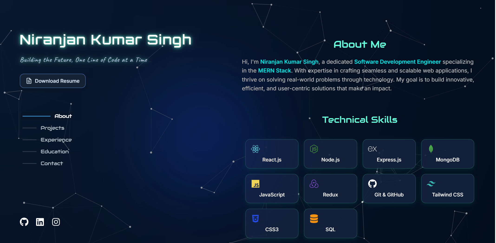

# 🚀 Niranjan Kumar Singh - Developer Portfolio

[](https://github.com/Niranjan-Kumar-Singh/Portfolio-Frontend/stargazers)
[](https://github.com/Niranjan-Kumar-Singh/Portfolio-Frontend/commits)
[](https://github.com/Niranjan-Kumar-Singh/Portfolio-Frontend/blob/main/LICENSE)
[](https://niranjankumarsingh.vercel.app)

> 🎯 A sleek and responsive **React + Vite** powered single-page portfolio built to showcase my journey, skills, and creations with ✨ custom UI elements like cursor effects, particles, and smooth animations.

🔗 **Live Site**: [https://niranjankumarsingh.vercel.app](https://niranjankumarsingh.vercel.app)

---

## 📸 Preview



---

## 💫 About Me

🎓 I'm **Niranjan Kumar Singh**, a final-year B.Tech CSE student at [Elitte College of Engineering](https://ece.ac.in/) (Graduating June 2025), based in Siliguri, West Bengal.

💻 I'm a passionate **MERN Stack Developer**, actively looking for **Frontend**, **Backend**, or **SDE** roles.

🧰 Skilled in React, Node.js, Express, MongoDB, and building intuitive, performant UIs.

---

## 🌐 Connect With Me

[](https://linkedin.com/in/niranjan-kumar-singh/)
[](https://github.com/Niranjan-Kumar-Singh)
[](https://x.com/niranjan_s_23)
[](https://instagram.com/niranjan._23)
[](https://facebook.com/niranjan.singh.1419)

---

## 💻 Tech Stack


---

## 🌟 Features

- ⚡ Blazing fast performance with Vite
- 📱 Fully responsive design for all screens
- 🧩 Modular & reusable React components
- 🎨 Glassmorphism UI + particle background
- 🧠 Structured experience/education timeline
- 📄 Resume download support
- 🕵️ SEO Optimized with sitemap and robots.txt
- 📊 Integrated Vercel Analytics

---

## 🌐 SEO & Accessibility

- ✅ Semantic HTML structure
- ✅ Open Graph & Twitter metadata
- ✅ Schema.org structured data (Person)
- ✅ Mobile-first, responsive layout
- ✅ Accessibility best practices followed

---

## 📁 Project Structure

```bash
portfolio/
├── public/                 # Static assets (favicon, resume, sitemap, etc.)
│   ├── images/
│   ├── favicon.ico
│   ├── resume.pdf
│   ├── robots.txt
│   ├── sitemap.xml
│   └── rocket-colorful.svg
├── src/
│   ├── components/         # Reusable UI components
│   ├── styles/             # Tailwind/custom styles
│   ├── App.jsx             # Main App component
│   └── main.jsx            # Entry point
├── vercel.json             # Vercel config (headers & rewrites)
└── README.md               # This file
```

---

### Run Locally

1. **Clone the Repository**:

```bash
git clone https://github.com/Niranjan-singh-code/portfolio.git
```

2. **Navigate to the Directory**:

```bash
cd portfolio
```

3. **Install dependencies**:

```bash
npm install
```

4. **Start development server**:

```bash
npm run dev
```

---

## 🚀 Deploy Your Own

[](https://vercel.com/new/clone?repository-url=https%3A%2F%2Fgithub.com%2FNiranjan-singh-code%2Fportfolio)

---

## ✍️ Quote of the Day


---

## 📈 Visitor Count

[](https://visitcount.itsvg.in)

---

## 📬 Contact Information

- 🧑 Name: **Niranjan Kumar Singh**  
- 📧 Email: [niranjansingh1419@gmail.com](mailto:niranjansingh1419@gmail.com)  
- 🔗 [LinkedIn](https://linkedin.com/in/niranjan-kumar-singh/)  
- 🐱 [GitHub](https://github.com/Niranjan-Kumar-Singh/)
- 📍 Location: Siliguri, West Bengal, India  

---

## 📄 License

This project is licensed under the [MIT License](LICENSE).

---

> Made with ❤️ by Niranjan Kumar Singh